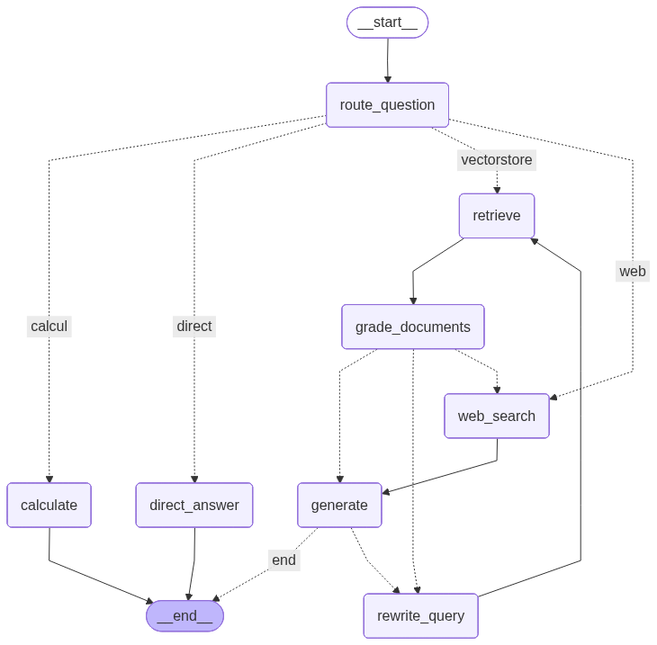

# Agentic RAG avec LangGraph — Assistant documentaire en Intelligence Artificielle

> **Master IIBDCC — SMA et IAD** — Prof. RETAL Sara
> Réalisé par : Abdelmajid El Ayachi
> Ce README tient lieu de rapport individuel (démarche, fonctionnement, résultats, limites).

## 1. Présentation et démarche

Ce projet implémente un système **RAG agentique** complet capable de répondre à des
questions simples et complexes sur le domaine de **l'intelligence artificielle**
(machine learning, deep learning, transformers, LLM, RAG, agents, bases vectorielles,
évaluation, éthique).

Contrairement à la méthode `create_agent` de LangChain qui fournit une boucle de
raisonnement prête à l'emploi, **l'architecture de l'agent est construite manuellement
avec LangGraph** : chaque nœud, chaque arête conditionnelle et chaque boucle de
correction est définie explicitement, ce qui rend le comportement de l'agent
transparent et contrôlable.

La démarche suivie respecte les étapes imposées :

1. **Construction de la base documentaire** — 10 documents markdown originaux
   (~6 800 mots) rédigés sur le domaine choisi, découpés en 95 chunks
   (taille 800, overlap 120) et indexés dans une base vectorielle **Chroma**
   persistée sur disque.
2. **Développement des modèles LLM** — Google **Gemini** (`gemini-3.1-flash-lite`)
   pour la génération, le routage et l'évaluation ; `gemini-embedding-001` pour les
   embeddings. Un *rate limiter* partagé respecte le quota gratuit de l'API.
3. **Création d'outils** — trois outils : `rechercher_documents` (retriever Chroma,
   top-k=4, similarité cosinus), `recherche_web` (DuckDuckGo, fallback quand la base
   ne suffit pas), `calculatrice` (expressions arithmétiques sécurisées).
4. **Architecture du graphe** — état typé (`AgentState`), nœuds spécialisés, arêtes
   conditionnelles, boucles de correction et **mémoire de conversation** via un
   checkpointer (`MemorySaver`, un fil par `thread_id`).
5. **Visualisation du graphe** — export Mermaid (`graph.mmd`) et PNG (`graph.png`).
6. **Évaluation** — 10 questions simples + 10 questions complexes, avec mesure du
   temps de réponse, de la pertinence des documents récupérés et de la qualité des
   réponses (LLM-as-a-judge). Résultats dans `evaluation/results.md`.

## 2. Fonctionnement du système

### 2.1 Architecture du graphe



Le flux de raisonnement de l'agent :

```
START → route_question
   ├─ 'vectorstore' → retrieve → grade_documents
   │       ├─ documents pertinents  → generate
   │       ├─ non pertinents        → rewrite_query → retrieve  (boucle, max 2)
   │       └─ reformulations épuisées → web_search → generate
   ├─ 'web'    → web_search → generate
   ├─ 'calcul' → calculate → END
   └─ 'direct' → direct_answer → END

generate → vérification d'ancrage (anti-hallucination)
   ├─ réponse fondée sur les documents → END
   └─ non fondée → rewrite_query (nouvelle boucle de retrieval)
```

Les capacités **agentiques** du système :

- **Routage** (`route_question`) : un LLM à sortie structurée (Pydantic) décide de la
  stratégie — retrieval documentaire, recherche web, calcul ou réponse directe.
- **Auto-évaluation du retrieval** (`grade_documents`) : chaque chunk récupéré est
  jugé pertinent ou non ; seuls les chunks utiles sont conservés.
- **Auto-correction** (`rewrite_query`) : si les documents sont jugés insuffisants, la
  question est reformulée avec un vocabulaire plus technique et le retrieval est
  relancé (2 tentatives maximum), avant un repli sur la recherche web.
- **Anti-hallucination** (`check_groundedness`) : après génération, un juge vérifie que
  la réponse est bien ancrée dans les documents ; sinon, une nouvelle boucle de
  retrieval est déclenchée.
- **Mémoire** : l'état (`messages` accumulés via `add_messages`) est persisté par le
  checkpointer `MemorySaver` ; l'agent se souvient des échanges précédents d'un même
  fil de conversation (ex. le prénom de l'utilisateur, la question précédente).

### 2.2 État du graphe

```python
class AgentState(TypedDict):
    messages: Annotated[list, add_messages]  # mémoire de conversation
    question: str            # question courante (éventuellement reformulée)
    original_question: str   # question initiale de l'utilisateur
    documents: list[Document] # documents jugés pertinents
    generation: str          # réponse produite
    datasource: str          # décision du routeur
    rewrites: int            # nombre de reformulations effectuées
    retrieval_grade: str     # verdict du grader ('oui'/'non')
```

### 2.3 Structure du projet

```
agentic-ai/
├── data/documents/        # base documentaire (10 fichiers .md)
├── src/
│   ├── config.py          # configuration (modèles, chunking, top-k)
│   ├── llm.py             # LLM Gemini + embeddings + rate limiter
│   ├── ingestion.py       # chargement, chunking, indexation Chroma
│   ├── tools.py           # outils : retriever, web, calculatrice
│   ├── state.py           # AgentState (état typé du graphe)
│   ├── nodes.py           # nœuds et arêtes conditionnelles
│   ├── graph.py           # construction du graphe + checkpointer
│   └── visualize.py       # export Mermaid / PNG du graphe
├── evaluation/
│   ├── questions.py       # 10 questions simples + 10 complexes
│   ├── evaluate.py        # protocole d'évaluation (temps, pertinence, qualité)
│   ├── results.md         # résultats détaillés
│   └── results.json       # résultats bruts
├── main.py                # interface conversationnelle (CLI)
├── graph.png / graph.mmd  # visualisation du graphe
└── README.md              # ce rapport
```

## 3. Installation et utilisation

```bash
# 1. Environnement (Python 3.12 recommandé)
uv venv --python 3.12 .venv
uv pip install -r requirements.txt

# 2. Clé API (gratuite) : https://aistudio.google.com/apikey
cp .env.example .env   # puis renseigner GOOGLE_API_KEY

# 3. Construire la base vectorielle
.venv/bin/python -m src.ingestion

# 4. Discuter avec l'agent
.venv/bin/python main.py

# 5. Visualiser le graphe
.venv/bin/python -m src.visualize

# 6. Lancer l'évaluation complète (≈ 15 min avec le quota gratuit)
.venv/bin/python -m evaluation.evaluate
```

## 4. Évaluation et résultats

Le protocole (`evaluation/evaluate.py`) mesure pour chacune des 20 questions :

- le **temps de réponse** total du graphe (routage → génération) ;
- la **route choisie** et le nombre de **reformulations** ;
- la **pertinence des documents** conservés après grading (juge LLM, note /5) ;
- la **qualité de la réponse** : exactitude, complétude, clarté (juge LLM, note /5).

### 4.1 Synthèse

| Catégorie | Questions | Note moyenne /5 | Pertinence docs /5 | Temps moyen (s) | Temps min–max (s) |
|---|---|---|---|---|---|
| Simples   | 10 | **5,0** | **5,0** | 15,5 | 14,1 – 24,3 |
| Complexes | 10 | **4,7** | **4,8** | 14,9 | 14,1 – 16,5 |

Les 20 questions ont toutes été routées vers `vectorstore` (routage correct : aucune
question du jeu de test ne nécessitait le web ou la calculatrice) et aucune
reformulation n'a été nécessaire : le retrieval a trouvé des documents jugés
pertinents dès la première tentative pour chaque question.

### 4.2 Analyse

- **Qualité des réponses** : parfaite sur les questions simples (10/10 notées 5/5).
  Sur les questions complexes, 8/10 obtiennent 5/5 ; les deux notes plus faibles
  (3/5 et 4/5) correspondent à des réponses **incomplètes** — le juge relève par
  exemple que l'explication du pipeline RAG omet certaines étapes et que le lien
  ReAct/function calling n'est pas pleinement développé. C'est une conséquence
  directe de la consigne stricte donnée au générateur de ne s'appuyer que sur les
  chunks récupérés (top-k = 4) : quand une réponse exhaustive exigerait plus de
  contexte, le modèle reste fidèle aux documents plutôt que d'inventer.
- **Pertinence du retrieval** : 5/5 sur toutes les questions simples, 4,8/5 en
  moyenne sur les complexes. Le grading de documents élimine efficacement les chunks
  hors sujet ; les questions multi-documents (ex. BERT vs GPT) récupèrent
  correctement des chunks issus de plusieurs fichiers.
- **Temps de réponse** : ~15 s en moyenne, quasi identique entre questions simples et
  complexes. Cette latence est dominée par le *rate limiter* (0,3 requête/s imposée
  par le quota gratuit Gemini) et par les 6-7 appels LLM séquentiels par question
  (routage, 4 gradings, génération, vérification d'ancrage) — et non par la
  complexité de la question. Sans limitation de quota, la latence serait de l'ordre
  de 3 à 5 s.
- **Fiabilité** : la vérification d'ancrage n'a déclenché aucune boucle de
  correction, ce qui indique que les réponses générées étaient systématiquement
  fondées sur les documents fournis.

Le détail question par question (réponses, sources, notes, justifications) est
disponible dans [`evaluation/results.md`](evaluation/results.md).

## 5. Limites et pistes d'amélioration

**Limites actuelles :**

- **Quota API gratuit** : le niveau gratuit de Gemini limite fortement le débit
  (requêtes/minute et /jour) ; un *rate limiter* et des pauses ont été ajoutés, ce qui
  augmente artificiellement le temps de réponse mesuré.
- **Grading séquentiel** : chaque chunk est évalué par un appel LLM séparé (4 appels
  par question), ce qui domine la latence totale.
- **Base documentaire modeste** : 10 documents (~95 chunks) ; les questions hors
  périmètre déclenchent le fallback web, dont la qualité dépend de DuckDuckGo.
- **Mémoire en RAM** : `MemorySaver` ne survit pas au redémarrage du processus.
- **Évaluation LLM-as-a-judge** : le juge est le même modèle que le générateur, ce qui
  peut introduire un biais d'auto-complaisance.

**Pistes d'amélioration :**

- Paralléliser le grading des documents (appels asynchrones) ou noter les 4 chunks en
  un seul appel pour réduire la latence de ~60 %.
- Remplacer `MemorySaver` par `SqliteSaver` pour une mémoire persistante, et ajouter
  une mémoire long terme (résumé de conversation, profil utilisateur).
- Ajouter un **re-ranker** (cross-encoder) après le retrieval et des techniques
  avancées (HyDE, multi-query, fusion RRF).
- Évaluer avec un juge indépendant (autre famille de modèles) et des métriques
  standardisées (RAGAS : faithfulness, answer relevance, context precision).
- Étendre la base documentaire (PDF, pages web) et gérer les mises à jour
  incrémentales de l'index.
