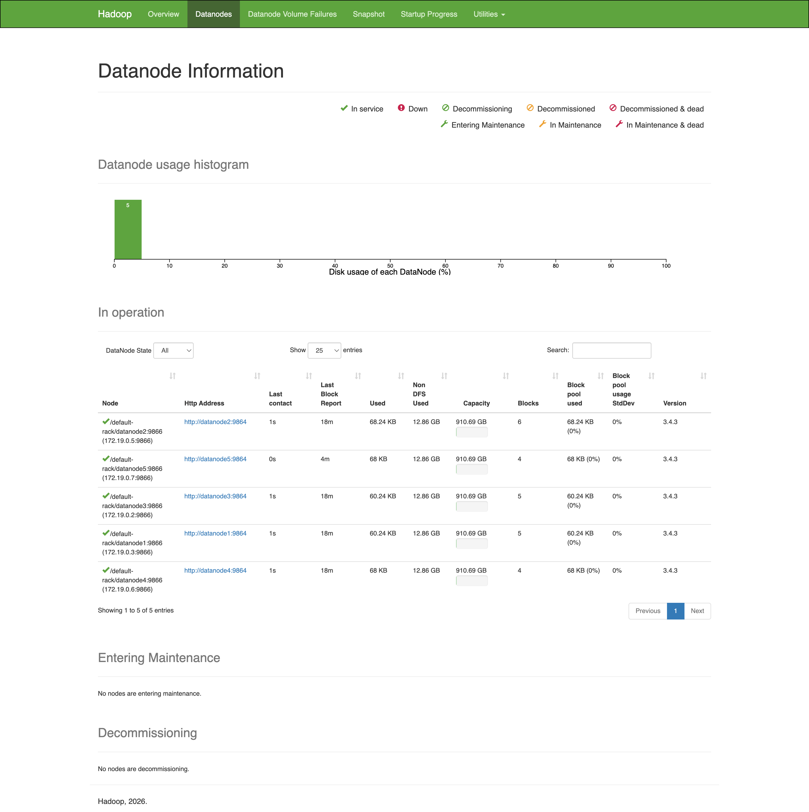

# TP1 — Atelier Hadoop HDFS avec Docker

**Module :** Big Data
**Cluster :** 1 NameNode + 5 DataNodes (image `apache/hadoop:3.4.3`, Docker Compose)

Les sorties complètes de chaque activité sont dans le dossier [`outputs/`](outputs/).

---

## Lancement du cluster

```bash
docker compose up -d
docker compose ps
```

Conteneurs démarrés : `namenode`, `datanode1` à `datanode5`, `resourcemanager`, `nodemanager`.

Interface web du NameNode : **http://localhost:9870** (vérifiée accessible).



Toutes les commandes HDFS sont exécutées depuis le conteneur NameNode :

```bash
docker compose exec namenode bash
```

---

## Activité 1 : état du cluster

```bash
hdfs dfsadmin -report
```

Résultat ([outputs/activite1_dfsadmin_report.txt](outputs/activite1_dfsadmin_report.txt)) :
- Capacité configurée : **4.45 TB**
- DFS utilisé : ~0 %
- **Live datanodes (5)**, aucun DataNode mort → cluster opérationnel.

## Activité 2 : arborescence HDFS

```bash
hdfs dfs -mkdir /atelier
hdfs dfs -mkdir /atelier/input /atelier/output /atelier/archive /atelier/logs
hdfs dfs -mkdir -p /datalake/ventes/raw /datalake/ventes/processed /datalake/ventes/archive
hdfs dfs -ls /
hdfs dfs -ls -R /datalake
```

L'option `-p` crée automatiquement les dossiers parents manquants. Sortie : [outputs/activite2_arborescence.txt](outputs/activite2_arborescence.txt).

## Activité 3 : fichiers CSV locaux

Création dans le conteneur de `/tmp/datasets/ventes_janvier.csv`, `ventes_fevrier.csv`, `ventes_mars.csv` (5 ventes chacun, colonnes `id_vente,date_vente,client,ville,categorie,produit,quantite,prix_unitaire,montant`). Sortie : [outputs/activite3_fichiers_locaux.txt](outputs/activite3_fichiers_locaux.txt).

## Activité 4 : envoi vers HDFS

```bash
hdfs dfs -put /tmp/datasets/ventes_janvier.csv /datalake/ventes/raw/
hdfs dfs -put /tmp/datasets/ventes_fevrier.csv /datalake/ventes/raw/
hdfs dfs -put /tmp/datasets/ventes_mars.csv /datalake/ventes/raw/
hdfs dfs -ls /datalake/ventes/raw
hdfs dfs -cat /datalake/ventes/raw/ventes_janvier.csv
hdfs dfs -head /datalake/ventes/raw/ventes_janvier.csv
```

Les 3 fichiers apparaissent dans la zone `raw` avec un facteur de réplication **3** (2ᵉ colonne du `ls`). Sortie : [outputs/activite4_put_hdfs.txt](outputs/activite4_put_hdfs.txt).

## Activité 5 : copier, déplacer, supprimer

```bash
hdfs dfs -cp /datalake/ventes/raw/*.csv /datalake/ventes/archive/
echo "fichier temporaire" > /tmp/test.txt
hdfs dfs -put /tmp/test.txt /atelier/input/
hdfs dfs -mv /atelier/input/test.txt /atelier/archive/
hdfs dfs -rm /atelier/archive/test.txt
```

`-cp` duplique le fichier (2 copies indépendantes dans HDFS), `-mv` le déplace sans copie de données (opération de métadonnées), `-rm` le supprime. Sortie : [outputs/activite5_cp_mv_rm.txt](outputs/activite5_cp_mv_rm.txt).

## Activité 6 : téléchargement HDFS → local

```bash
mkdir -p /tmp/export
hdfs dfs -get /datalake/ventes/raw/ventes_janvier.csv /tmp/export/
```

Le fichier est copié en local **et reste présent dans HDFS**. Sortie : [outputs/activite6_get_local.txt](outputs/activite6_get_local.txt).

## Activité 7 : taille des fichiers

```bash
hdfs dfs -du -h /datalake/ventes/raw
hdfs dfs -count /datalake/ventes/raw
```

`-du -h` affiche 2 colonnes : taille réelle (~378 o) et taille **avec réplication** (~1.1 K = 3 × la taille). `-count` : 1 dossier, 3 fichiers, 1133 octets. Sortie : [outputs/activite7_tailles.txt](outputs/activite7_tailles.txt).

## Activité 8 : blocs HDFS

```bash
hdfs fsck /datalake/ventes/raw/ventes_janvier.csv -files -blocks -locations
hdfs fsck /datalake/ventes/raw -files -blocks -locations
```

Interprétation ([outputs/activite8_blocs_fsck.txt](outputs/activite8_blocs_fsck.txt)) :
- Chaque fichier tient dans **1 seul bloc** (taille << 128 Mo, la taille de bloc configurée).
- Chaque bloc a **Live_repl=3** : 3 copies sur 3 DataNodes différents (les adresses IP des DataNodes sont listées).
- `Status: HEALTHY`, 0 bloc manquant/corrompu.

## Activité 9 : facteur de réplication

```bash
hdfs dfs -setrep -w 2 /datalake/ventes/raw/ventes_janvier.csv   # passe à 2
hdfs dfs -setrep -w 3 /datalake/ventes/raw/ventes_janvier.csv   # retour à 3
hdfs dfs -setrep -w 3 /datalake/ventes/raw/ventes_fevrier.csv
hdfs dfs -setrep -w 3 /datalake/ventes/raw/ventes_mars.csv
```

Après `setrep -w 2`, `fsck` montre `replication=2, Live_repl=2` (une copie a été supprimée). Après retour à 3, `Average block replication: 3.0`. L'option `-w` attend que la réplication soit effective. Sortie : [outputs/activite9_replication.txt](outputs/activite9_replication.txt).

## Activité 10 : panne d'un DataNode

```bash
docker compose stop datanode5
docker compose exec namenode hdfs dfs -cat /datalake/ventes/raw/ventes_janvier.csv   # ✅ fonctionne
docker compose exec namenode hdfs fsck /datalake/ventes/raw -files -blocks -locations # Status: HEALTHY
docker compose start datanode5
```

Observations ([outputs/activite10_panne_datanode.txt](outputs/activite10_panne_datanode.txt)) :
- Le fichier reste **parfaitement lisible** : HDFS sert les blocs depuis les répliques des autres DataNodes.
- Le `Last contact` de datanode5 cesse d'avancer (preuve qu'il n'envoie plus de heartbeat). Le NameNode ne le déclare `dead` qu'après ~10 minutes sans heartbeat, c'est pourquoi le rapport peut encore afficher « Live datanodes (5) » juste après l'arrêt.
- Après `docker compose start datanode5`, le nœud réintègre le cluster.

---

## Exercice de synthèse

Commandes exécutées ([outputs/exercice_synthese.txt](outputs/exercice_synthese.txt)) :

```bash
# 1-2. Arborescence
hdfs dfs -mkdir /exercice
hdfs dfs -mkdir /exercice/raw /exercice/archive /exercice/export

# 3. Fichier local
cat > /tmp/clients.csv << 'EOF'
id_client,nom,ville,pays
1,Ahmed,Casablanca,Maroc
2,Fatima,Rabat,Maroc
3,Youssef,Fes,Maroc
4,Sara,Marrakech,Maroc
EOF

# 4. Envoi vers HDFS
hdfs dfs -put /tmp/clients.csv /exercice/raw/

# 5. Lecture
hdfs dfs -cat /exercice/raw/clients.csv

# 6. Copie vers archive
hdfs dfs -cp /exercice/raw/clients.csv /exercice/archive/

# 7. Téléchargement vers le local
mkdir -p /tmp/export_exercice
hdfs dfs -get /exercice/raw/clients.csv /tmp/export_exercice/

# 8. Taille
hdfs dfs -du -h /exercice/raw

# 9. Blocs
hdfs fsck /exercice/raw/clients.csv -files -blocks -locations

# 10. Réplication à 3
hdfs dfs -setrep -w 3 /exercice/raw/clients.csv
```

### Livrable : `hdfs dfs -ls -R /exercice`

```
drwxr-xr-x   - hadoop supergroup          0 2026-07-12 18:20 /exercice/archive
-rw-r--r--   3 hadoop supergroup        114 2026-07-12 18:20 /exercice/archive/clients.csv
drwxr-xr-x   - hadoop supergroup          0 2026-07-12 18:19 /exercice/export
drwxr-xr-x   - hadoop supergroup          0 2026-07-12 18:19 /exercice/raw
-rw-r--r--   3 hadoop supergroup        114 2026-07-12 18:19 /exercice/raw/clients.csv
```

### Livrable : `hdfs fsck /exercice/raw/clients.csv -files -blocks -locations`

```
/exercice/raw/clients.csv 114 bytes, replicated: replication=3, 1 block(s):  OK
0. BP-494732249-172.19.0.8-1783879466631:blk_1073741832_1008 len=114 Live_repl=3
   [172.19.0.2:9866, 172.19.0.3:9866, 172.19.0.5:9866]

Status: HEALTHY
 Total blocks (validated): 1
 Average block replication: 3.0
 Missing blocks: 0 / Corrupt blocks: 0
```

Le fichier (114 octets) tient dans 1 bloc, répliqué 3 fois sur 3 DataNodes distincts.

### Livrable : rôle de la réplication

La réplication consiste à conserver plusieurs copies (par défaut 3) de chaque bloc de données sur des DataNodes différents. Elle garantit la **tolérance aux pannes** : si un DataNode tombe (démontré à l'activité 10 avec l'arrêt de `datanode5`), les données restent lisibles car le NameNode redirige les lectures vers les répliques des autres nœuds ; il peut aussi re-répliquer les blocs sous-répliqués pour rétablir le facteur cible. Elle améliore également la **disponibilité et les performances de lecture**, plusieurs nœuds pouvant servir le même bloc en parallèle. Le coût est un espace de stockage multiplié par le facteur de réplication (visible avec `hdfs dfs -du -h` : 378 o → 1.1 K).
