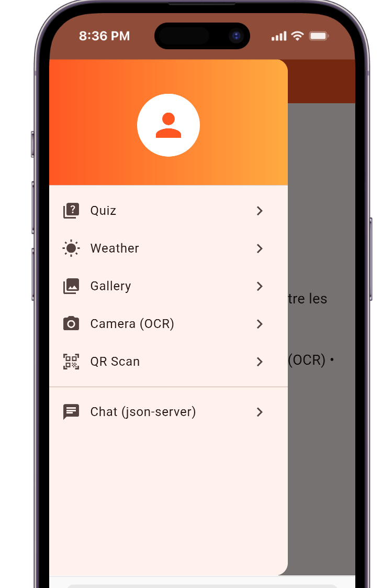
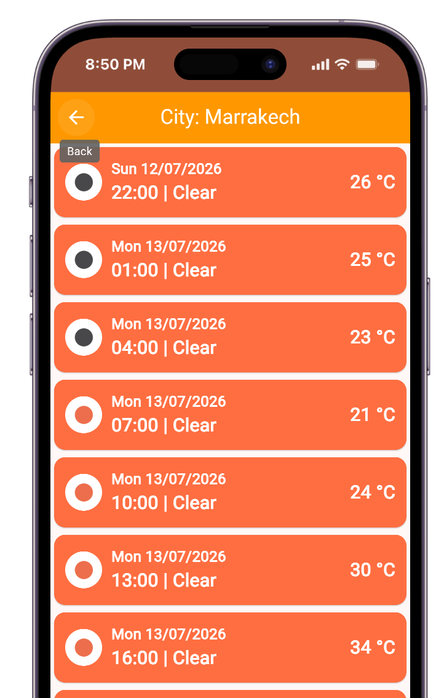
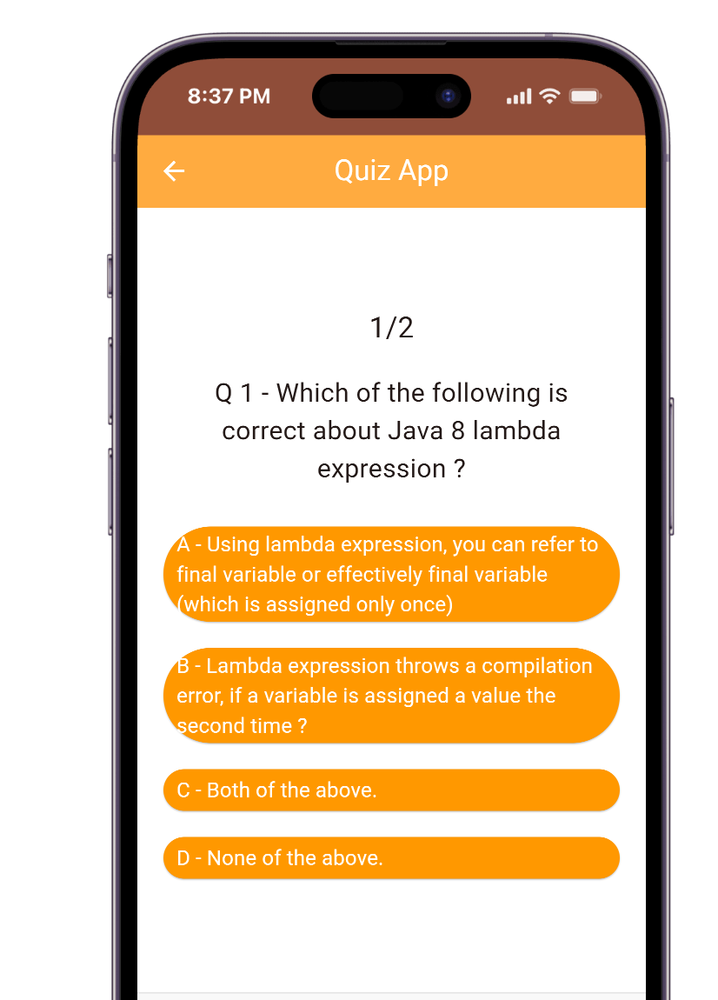
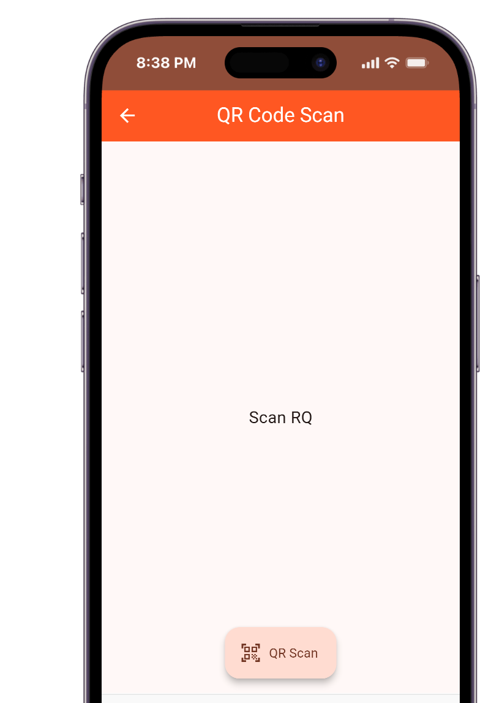
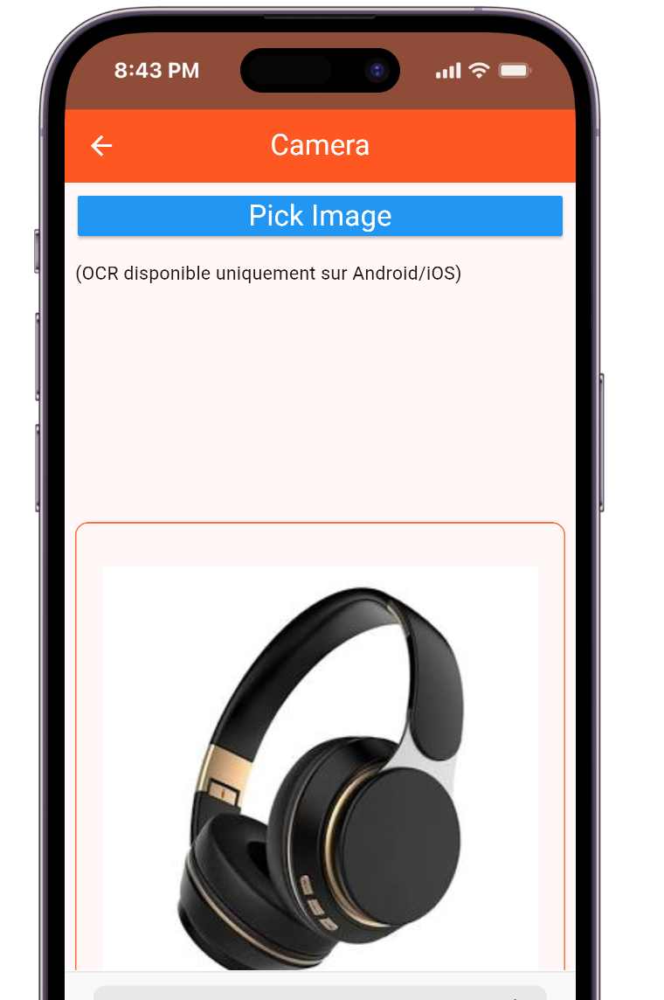
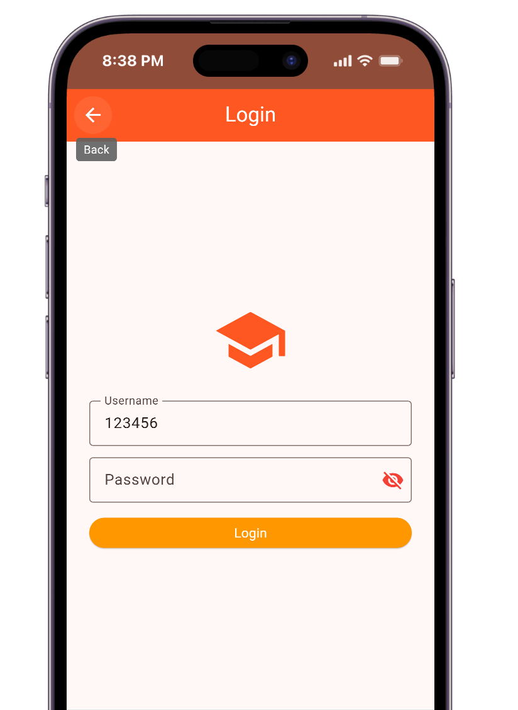

# Introduction à Flutter — TP

Reproduction **modernisée** des dernières applications du support
`Introduction_Flutter_P1.pdf` : une seule application Flutter avec un menu
(drawer) donnant accès aux modules du cours.

## Modules

| Module | Contenu du support | Améliorations apportées |
|---|---|---|
| **Quiz** | Widgets `Quiz` / `Question` / `Answer` / `Score` | Null safety, `ElevatedButton`/`TextButton` (les `RaisedButton`/`FlatButton` du support ont été supprimés de Flutter) |
| **Weather** | Prévisions OpenWeatherMap dans une `ListView` de `Card` | Champ de saisie de la ville, HTTPS + `units=metric`, icônes météo chargées depuis OpenWeatherMap (plus besoin d'assets PNG), gestion d'erreurs |
| **Gallery** | Recherche Pixabay paginée avec scroll infini (`ScrollController`) | `webformatURL` (meilleure qualité), gestion d'erreurs, encodage de l'URL |
| **Camera (OCR)** | `image_picker` + `image_cropper` + `firebase_ml_vision` | `firebase_ml_vision` est abandonné → remplacé par `google_mlkit_text_recognition` (aucun projet Firebase nécessaire) |
| **QR Scan** | `barcode_scan` | Package mort → remplacé par `mobile_scanner` (Android/iOS/web/macOS) avec torche |
| **Chat** | Backend `json-server` : login, contacts (filtres par type), messages avec réponse automatique | Null safety, modèles `fromJson`/`toJson`, bulles de chat, pull-to-refresh |

## Lancer l'application

```bash
flutter pub get
flutter run          # sur un émulateur/appareil Android ou iOS
```

Clés API (par défaut : celles du support) :

```bash
flutter run --dart-define=OWM_API_KEY=votre_cle --dart-define=PIXABAY_API_KEY=votre_cle
```

> La clé OpenWeatherMap du support est la clé de démonstration ; pour de
> vraies données, créez une clé gratuite sur openweathermap.org.

## screenshots 
### menu 


### meteo 


### Quiz

### QR Scanner

### image uploader

### db viewer 



## Backend du chat (json-server)

```bash
npm install -g json-server
json-server --watch db.json          # http://localhost:3000
```

- Login : username `123456`, password `1234` (resource `users` de `db.json`).
- Depuis l'émulateur Android, l'app utilise automatiquement `10.0.2.2:3000`.
- Autre machine/appareil physique : `--dart-define=JSON_SERVER_URL=http://IP:3000`.

## Permissions natives

Après `flutter create .`, ajouter :

- **Android** (`android/app/src/main/AndroidManifest.xml`) :
  `INTERNET`, `CAMERA` ; et pour http local (json-server) :
  `android:usesCleartextTraffic="true"` sur `<application>`.
- **iOS** (`ios/Runner/Info.plist`) : `NSCameraUsageDescription`,
  `NSPhotoLibraryUsageDescription`.

## Tests

```bash
flutter test
```


